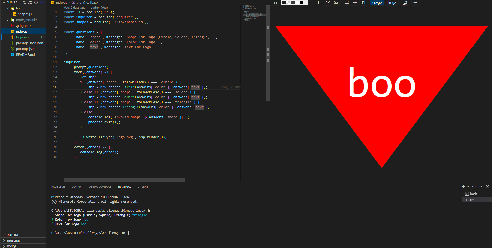

# SVG Logo Generator

## Description

- My motivation for this project was to create a tool to easily generate any sort of logo.
- I built this project to further utilize knowledge of generating files using user prompts.
- This code is effective in creating a personalized logo for many different needs.
- Composing this task scheduler, I learned how to prompt node to generate an SVG file correlating with user input.

## Github & Deployed Site
- [Github Repository](https://github.com/Celyph/logo-generator)

## Usage

https://github.com/Celyph/logo-generator/assets/122329678/b4277545-0fe5-4226-b3f6-f777c60cb398

## Credits

I used the ReadMe guide from [https://coding-boot-camp.github.io/full-stack/github/professional-readme-guide](https://coding-boot-camp.github.io/full-stack/github/professional-readme-guide).
